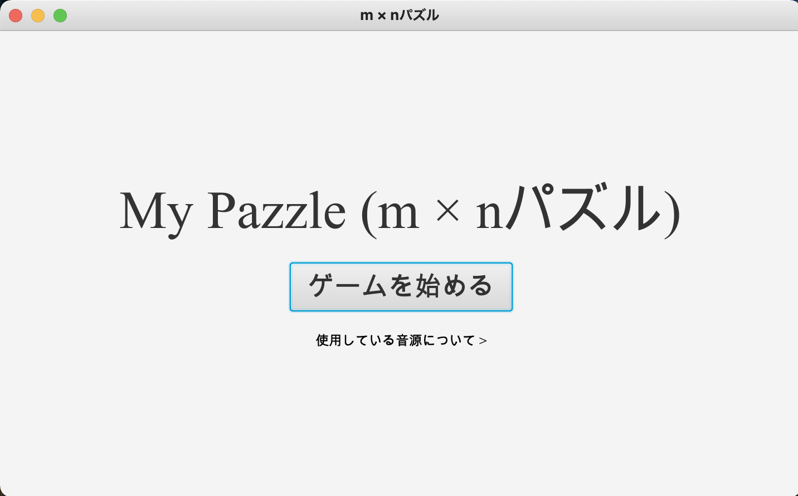
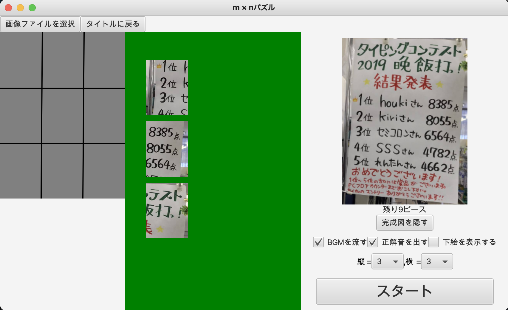
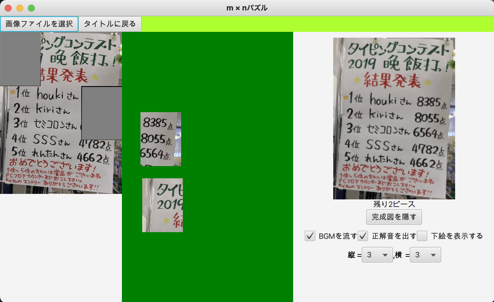
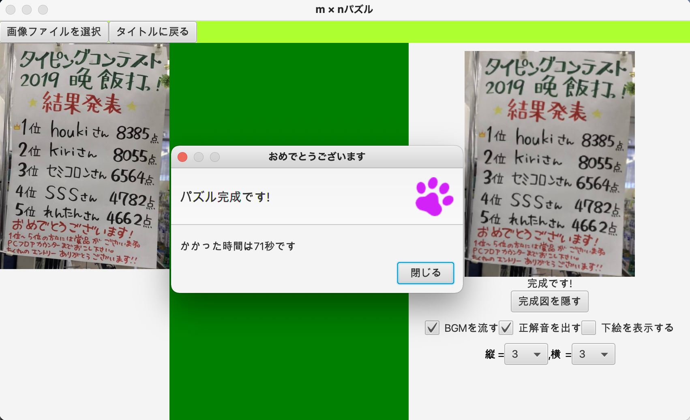
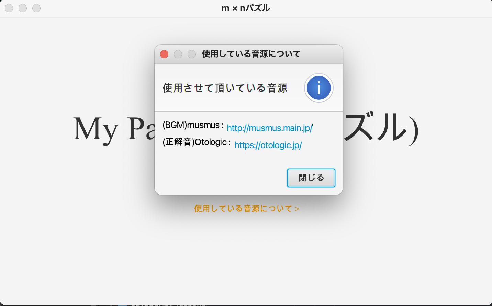

# My-jigsaw-pazzle (m×nパズル)

自由に画像を読み込みジグソーパズルとして遊ぶゲームです．
$$1 \leq m, n \leq 9$$　で最小 1 ピース ~ 81 ピースにで遊ぶことが出来ます．

<h1>遊び方</h1>
    
1. 右下の「スタート」ボタンでゲームが開始される．
2. 中央（緑）に置かれたパズルのピースを左の灰色の上に置いていく．  
   (正しい位置に置かれると正解音が鳴り，自動で正確な位置にピースを移動してくれます．)  
3. すべて正しい位置にピースを置くと成功です．  

使用させていただいた音源はこちらになります．

musmus: http://musmus.main.jp/ 

Otologic：https://otologic.jp/

タイトル画面 

ゲーム開始画面　

ピースが置かれている画面 

完成時 

音源について 

